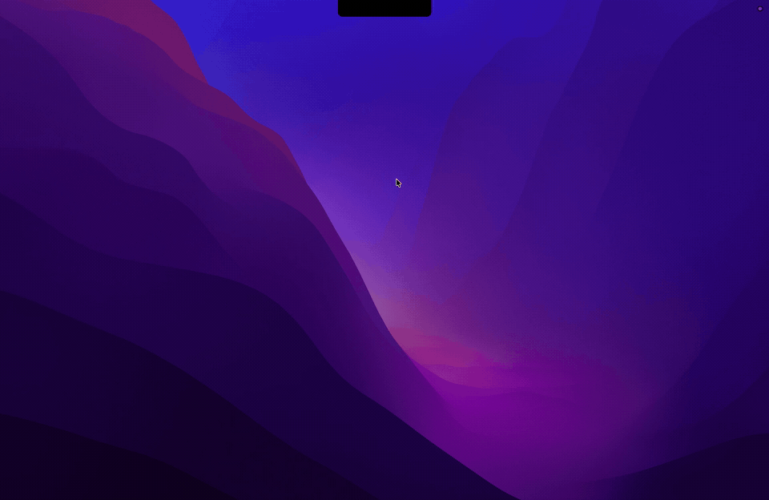

# Gleam

A notch mirror app for macOS.



## Requirements

- macOS 26 (Tahoe) or later
- A Mac with a notch and a camera — Gleam has nowhere to live on a screen without one
- Xcode 26 or later to build

## Clone and Build

```sh
git clone https://github.com/itsdingze/gleam.git
cd gleam
cp Gleam.xcconfig.template Gleam.xcconfig
```

Edit `Gleam.xcconfig` with your own development team ID and bundle ID prefix, then open `Gleam.xcodeproj` in Xcode and run the `Gleam` scheme.

Or build and test from the command line:

```sh
xcodebuild -project Gleam.xcodeproj -scheme Gleam -destination 'platform=macOS' build
xcodebuild -project Gleam.xcodeproj -scheme Gleam -destination 'platform=macOS' test
```

## License

GPL-3.0, see [LICENSE](LICENSE).
